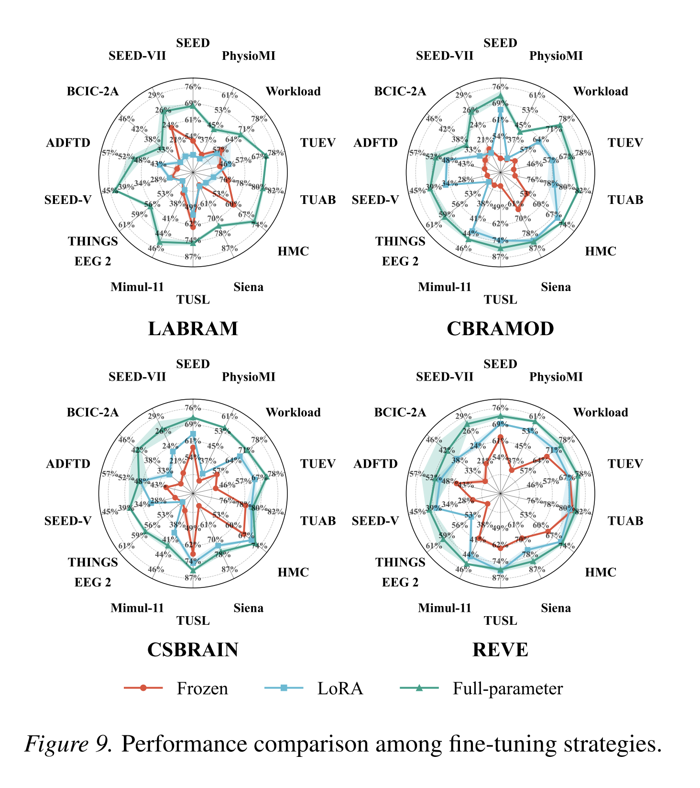

# A Systematic Evaluation of Parameter-Efficient Fine-Tuning for Clinical EEG Foundation Models

---
## 零、研究背景与研究步骤

### 研究背景

从目前文献来看，使用 PEFT 的 EEG 基础模型工作仍然属于少数，主流做法仍是 full fine-tuning 和 linear probing / head-only probing。PEFT 正在快速增长，但更多是作为“低资源、临床可部署”场景下的专门方案出现，而不是当前领域的默认微调范式。

主流基准仍以 full fine-tuning 为默认：在 EEG-FM-Bench 这个专门用于系统评测 EEG 基础模型的统一基准中，作者明确将 "frozen backbone、full-parameter fine-tuning、LoRA" 三类策略纳入比较，并指出 "full-parameter fine-tuning consistently yields the highest performance"，而 frozen backbone 存在严重的泛化差距，LoRA 能缩小部分差距但高度依赖 backbone 质量。该评测覆盖了 BENDR、BIOT、LaBraM、EEGPT、CBraMod、CSBrain、REVE 等 7 个主流 EEG 基础模型，结果说明领域内的"上限"仍然由全量微调定义。

*Figure 9. 在 LaBraM、CBraMod、CSBrain、REVE 四个 backbone 上，Frozen、LoRA、Full-parameter 三种微调策略跨 12 个数据集的性能对比。*

类似地，Kommineni 等人提出的多维度泛化评估框架也对比了 full fine-tuning、linear probing 和 LoRA（仅训练约 2%–4% 参数），发现基础模型在长时序任务（如睡眠分期）和抑郁分类上有优势，但在短窗口 BCI 任务上，全量微调的监督模型仍然极具竞争力。Širca 等人的 Beyond Accuracy 研究同样只比较了 full fine-tuning 与 head-only probing（即线性探测），并观察到 head-only 与全量微调的差距很大程度上来自池化方式，而不是表征本身弱。

真正把 PEFT 作为核心方法的工作目前数量有限（2024-2025），主要包括：

- EEG-GraphAdapter：在冻结 BENDR 主干的前提下插入 GNN 适配器，仅训练约 100–200 万参数，在 MDD 与 TUAB 上超过全量微调。
- SCOPE：提出 ProAdapter，在 6 个数据集、5 个 backbone 上仅训练 2%–5% 参数，稳定超过全量微调和 LoRA；作者还特别指出 “LoRA can fall below the frozen baseline”。
- Plug-and-Play LaBraM LoRA：在 54 被试的运动想象数据集上比较了 DeepConvNet、LaBraM partial fine-tuning 和 LoRA，发现 LoRA 虽然总体精度不如专用 CNN，但训练参数减少两个数量级，单 epoch 训练时间缩短 35%，且跨被试校准更稳定。
- 此外还有 OpenReview 上的 “A versatile and parameter-efficient tuning for EEG foundation model”、ACM 上的 “Parameter-Efficient Transfer Learning for EEG Foundation Models via Task-Relevant Feature Focusing”、以及 Pattern Recognition 上的 EEGTune 等数据高效微调框架。

### 研究步骤：

- 对现有模型进行微调
- 使用评估体系进行评估
- 

## 一、EEG 基础模型评测框架汇总

### 1. Kastrati 等 (2025) — *EEG-Bench: A Benchmark for EEG Foundation Models in Clinical Applications*

> 聚焦**临床应用场景**的评测基准。
#### 评估指标

- 平衡准确率 (Balanced Accuracy)：这是临床任务的首选指标。它计算的是每个类别的召回率（Recall/Sensitivity）的平均值。如果一个模型只会把所有人都预测为“健康”，普通准确率可能很高，但平衡准确率会非常低。这能公平反映模型对少数病理样本的诊断能力。

- 加权 F1 分数 (Weighted F1-score)：F1 分数是精确率（Precision）和召回率的调和平均值。加权 F1 根据数据集中每个类别的真实样本比例分配权重，非常适合类别数量差异巨大的临床数据集。

#### 数据集（共 14 个）

| 类别 | 数据集 |
|------|--------|
| 常规与异常脑电 | TUAB（异常脑电检测）、TUAR（伪影）、TUEP（癫痫）、CHB-MIT（癫痫发作） |
| 睡眠 | Sleep-Telemetry（睡眠分期） |
| 帕金森病 | Cavanagh2018a、Cavanagh2018b、Singh2018、Singh2020、Singh2021、Brown2020 |
| 其他疾病 | Cavanagh2019（mTBI）、Albrecht2019（精神分裂症）、Gruendler2009（强迫症 OCD） |

#### 任务（共 11 项）

- 正常 vs. 异常脑电二分类（Abnormal vs. Normal）
- 癫痫 vs. 非癫痫二分类（Epilepsy vs. No Epilepsy）
- 帕金森病分类 — 全数据集混合（PD All）
- 帕金森病分类 — 跨数据集测试（PD Held-Out）
- 强迫症检测（OCD）
- 轻度创伤性脑损伤检测（mTBI）
- 精神分裂症检测（Schizophrenia）
- 伪影检测 — 二分类（Binary Artifact）
- 伪影检测 — 多分类（Multiclass Artifact）
- 睡眠分期（Sleep Stages）
- 癫痫发作检测（Seizure）

#### 模型

- **传统机器学习基线**：SVM、LDA（使用 Brainfeatures 工具箱提取时频域、统计和复杂度等特征）
- **脑电基础模型**：BENDR、Neuro-GPT、LaBraM

---

### 2. Lu 等 (2026) — *OmniEEG-Bench: A Standardized Evaluation Benchmark for EEG Foundation Models*

> 提出了一个**大一统基准**，覆盖面极广。

#### 评估指标
- 任务级指标：根据任务类型（如二分类、多分类）使用 Accuracy (准确率) 和 F1-score。

- 全局宏观指标 —— 平均排名 (Average Rank)：由于跨越了数十个不同的数据集，绝对的分数无法直接跨任务相加。因此，作者在对比 10 大基础模型时，主要汇报了它们在所有任务中的“平均排名”（Average rank，数值越低代表综合性能越强，泛化能力越好）。

#### 数据集（共 54 个）

涵盖开源社区极其广泛的数据集，包括：

- **异常/噪声**：EEGDenoiseNet、TUAB、TUEV、TUEP、TUSL
- **人口统计学**：MPI-LEMON（年龄/性别/性格）
- **临床疾病**：Siena EEG、ADHD、AD65、PD31、TDBRAIN、MDD、MODMA
- **睡眠**：ISRUC-Sleep 系列、Sleep-EDF、HMC
- **情感与认知**：SEED 系列（SEED、SEED-IV、SEED-V 等）、DEAP、FACED
- **BCI 与交互**：BCI-Speech、Things-EEG2、BCI Competition IV-2A & IV-1、PhysioNet-MI、BETA-SSVEP 等

#### 任务（6 大家族，共 58 项）

1. **信号可靠性（Signal Reliability）** — 伪影/噪声识别、纵向重测信度
2. **生物特征与疾病（Biometrics & Disease）** — 年龄/性别预测、癫痫检测、ADHD、阿尔茨海默病、帕金森病、抑郁症检测等
3. **意识与状态（Consciousness & State）** — 意识水平检测、睡眠分期、认知任务状态识别
4. **认知与情感（Cognition & Emotion）** — 警觉性检测、多分类情绪识别、工作/认知负荷评估
5. **自然刺激解码（Naturalistic Stimulus Decoding）** — 自然语音感知与注意力解码、阅读解码、视觉语义分类
6. **运动与交互（Motor & Interaction）** — 运动想象、SSVEP 目标识别、错误相关电位反馈、闭环辅助控制

#### 模型

- **脑电基础模型（10 种）**：BENDR、BIOT、LaBraM、CBraMod、BrainOmni、FEMBA、Neuro-GPT、NeuroLM、EEGMamba、REVE
- **特定任务神经网络基线**：EEGConformer、EEGNet

---

### 3. Yang 等 (2026) — *Are EEG Foundation Models Worth It?*

> 聚焦基础模型在 **BCI 及相关任务**中的实用性，重点对比非神经网络经典解码器。

#### 评估指标

- 针对分类任务（如运动想象、内在语音识别）：文章在所有的模型性能对比图表（如不同训练数据比例下的表现图）中，均明确声明以 平衡准确率 (Balanced Accuracy) 作为核心对比标准。

- 针对回归任务（如听觉注意力解码、警觉性预测）：通常采用 皮尔逊相关系数 (Pearson Correlation Coefficient, r) 或均方根误差 (RMSE) 来评估模型输出连续值的趋势与真实生理状态的拟合程度。

#### 数据集（主要 8 个 + 额外 2 个）

| 数据集 | 用途 |
|--------|------|
| Error-Related EEG Dataset | 人机交互错误相关负电位 |
| Alzheimer's Diagnosis EEG | 阿尔茨海默病与额颞叶痴呆 |
| Thinking Out Loud | 内在语音识别 |
| BCI Competition IV 2a | 经典运动想象 |
| Upper-Limb Motor Execution/Imagery | 上肢运动执行与想象 |
| Binocular Dual-Frequency SSVEP | 双目双频 SSVEP |
| DTU "Cocktail Party" | 鸡尾酒会效应 / 听觉注意力 |
| SEED-VIG | 模拟驾驶警觉性 |

> *额外 Zero-shot 评估：FACED（情绪）、TUEV（异常事件）*

#### 任务（7 项分类 + 2 项回归）

**分类任务：**

- 2 分类 ERN 检测
- 3 分类阿尔茨海默病诊断
- 4 分类内在语音（Inner Speech）识别
- 4 分类运动想象
- 7 分类上肢运动执行
- 7 分类上肢运动想象
- 40 分类双目 SSVEP 目标识别
- *Zero-shot*：9 分类情绪、6 分类事件

**回归任务：**

- 听觉注意力解码（Auditory Attention Decoding，重建语音包络）
- 警觉性水平预测（Vigilance Level Prediction）

#### 模型

- **脑电基础模型**：BENDR、BIOT、LaBraM、EEGPT、CBraMod，以及作者提出的基于掩码自编码器（MAE）预训练的 **ST-EEGFormer**
- **经典神经网络（Classic NN）**：DeepConvNet、EEGNet、EEG Conformer、CTNet
- **经典非神经网络（Classic Non-NN）**：
  - 基于 CSP/FBCSP 特征的 LDA/SVM
  - 黎曼几何分类器（MDM、FgMDM、TS-ElasticNet）
  - 相对频带功率（RBP）结合 RF/SVM/kNN/LightGBM
  - xDAWN-LDA/MDM
  - SSVEP 专用：FBCCA、TRCA

---

### 4. EEG-FM-Bench: A Comprehensive Benchmark for the Systematic Evaluation and Diagnostic Analyses of EEG Foundation Models

> 提出了一套**系统化评测与诊断分析基准**，首次将 frozen backbone、full-parameter fine-tuning、LoRA 三类微调策略纳入统一比较框架，并指出全量微调仍具有最高性能上限。

#### 评估指标
- 多分类任务和通用脑电分类广泛使用 Accuracy (准确率) 和 Macro F1-score (宏平均 F1 分数)。

- 在涉及二分类的疾病检测（如 TUAB 异常检测、ADFTD 阿尔茨海默检测）中，也会使用 AUROC (接收者操作特征曲线下面积) 来评估模型区分正负样本的综合阈值能力。

#### 数据集（共 10 个）

| 类别 | 数据集 |
|------|--------|
| 运动想象 | BCIC-2a、PhysioMI、Mimul-11 |
| 情绪识别 | SEED、SEED-V、SEED-VII |
| 睡眠分期 | HMC |
| 癫痫发作检测 | Siena |
| 精神压力评估 | Workload |
| 异常脑电检测 | TUAB |
| 事件类型分类 | TUEV |
| 视觉目标检测 | Things-EEG-2 |
| 阿尔茨海默病识别 | ADFTD |
| 慢波事件分类 | TUSL |

#### 任务（共 10 项）

- 运动想象分类（Motor Imagery Classification）
- 情绪识别（Emotion Recognition）
- 睡眠分期（Sleep Stage Classification）
- 癫痫发作检测（Seizure Detection）
- 精神压力评估（Mental Stress Assessment）
- 异常脑电检测（Abnormal Detection）
- 事件类型分类（Event Type Classification）
- 视觉目标检测（Visual Target Detection）
- 阿尔茨海默病识别（Alzheimer's Disease Recognition）
- 慢波事件分类（Slowing Event Classification）

#### 模型

- **脑电基础模型（EEG-FMs）**：BENDR、BIOT、LaBraM、EEGPT、CBraMod、CSBrain、REVE
- **通用时间序列模型（General Time-Series Models）**：Mantis、Moment

### 5. A Multi-dimensional Framework for Evaluating Generalization in EEG Foundation Models （预印版）

---

## 二、基础模型简介

### 1. LaBraM (Large Brain Model)

- **核心机制**：该模型借鉴了自然语言处理（NLP）中掩码语言建模（Masked Language Modeling）的思想。它将连续的多导联脑电信号分割并转换为离散的 Token（或直接作为连续特征输入），通过掩码自编码器（Masked Autoencoder, MAE）机制随机遮蔽一部分脑电片段，让模型去预测被遮蔽的内容。
- **主要优势**：在临床诊断任务（如癫痫、帕金森）和复杂的脑机接口（BCI）解码中都表现出了极强的通用表征能力，是当前该领域最受关注的基线模型之一。
- **出现位置**：三篇文章全部将其作为核心评估对象。

### 2. BENDR (Brain Encoder for Neural Decoded Representations)

- **核心机制**：作为脑电基础模型领域的"拓荒者"之一，BENDR 采用了经典的 **Transformer 编码器**架构。它通过自监督学习从未标注的海量脑电数据中提取深层时空特征。通常包含掩码机制，旨在捕捉脑电波复杂的长序列依赖关系。
- **主要优势**：由于提出时间较早，它在各类基准测试中被作为对比的标准参照物。它证明了纯 Transformer 架构完全有能力消化生理电信号的非平稳特性。
- **出现位置**：三篇文章全部将其作为核心评估对象。

### 3. Neuro-GPT / NeuroGPT

- **核心机制**：该模型深度借鉴了生成式预训练（Generative Pre-trained Transformer, GPT）的单向预测逻辑。它将脑电信号序列化处理，通过自回归（Autoregressive）的方式预测下一个时间步的脑电信号或表征。
- **主要优势**：非常适合模拟脑电信号随时间演进的动态过程。在疾病筛查（如异常脑电检测）和状态监测（如睡眠分期）中展现了不俗的生成与判别能力。
- **出现位置**：Kastrati 临床基准、Lu 全领域基准。

### 4. BIOT (Biosignal Transformer)

- **核心机制**：BIOT 是一种面向**多模态生物信号**的通用 Transformer 架构。它不仅针对脑电（EEG），也常被扩展到心电（ECG）等其他生理信号。它通过精心设计的 Patch 划分策略和注意力机制，能够同时兼顾不同通道间（空间维度）以及时间序列内（时间维度）的关联。
- **主要优势**：泛化性能极佳，特别擅长处理跨导联、多通道的复杂生理信号交互，在多领域大一统评测中名列前茅。
- **出现位置**：Lu 全领域基准、Yang 脑机接口基准。

---

## 三、参数高效微调（PEFT）方法

参数高效微调（Parameter-Efficient Fine-Tuning, **PEFT**）是目前大模型（包括 NLP、CV 以及 EEG 基础模型）下游适配的绝对主流技术。它的核心思想是：**冻结预训练模型的大部分权重，只微调或增加极少量的参数**，从而在大幅降低算力、显存消耗的同时，达到媲美甚至在特定场景下超越全量微调（Full Fine-Tuning）的性能。

### 1. 基于重参数化（Reparameterization-based）

这是目前应用最广、效果最稳定的一类方法，尤以 LoRA 家族为代表。

- **LoRA (Low-Rank Adaptation)**
  - **原理**：假设模型在微调时权重的更新量（$\Delta W$）具有"低秩"的内在特性。LoRA 冻结了原始的大矩阵权重，通过引入两个较小的矩阵相乘（降维矩阵 $A$ 和升维矩阵 $B$）来模拟权重的变化。微调结束后，可以把 $A \times B$ 的结果无缝加回到原权重中，推理时没有任何额外延迟。
  - **适用场景**：几乎所有 Transformer 架构，是目前的首选 Baseline。

- **QLoRA (Quantized LoRA)**
  - **原理**：在 LoRA 的基础上，将预训练模型的主干权重极度量化（比如 4-bit 精度），同时在 16-bit 精度下训练 LoRA 参数。这使得在单张消费级显卡上微调极大参数量的模型成为可能。

- **AdaLoRA (Adaptive LoRA)**
  - **原理**：LoRA 会给所有层分配相同的"秩（Rank）"，但不同层的重要性不同。AdaLoRA 会根据参数的重要性自动动态分配预算，重要的层给更高的秩，不重要的层给更低的秩甚至裁剪掉。

### 2. 基于加性模块（Additive / Adapter-based）

这是最早被提出的一类 PEFT 方法。

- **Adapter Tuning**
  - **原理**：在原有的网络层（通常是 Transformer 的 Attention 层和 FFN 层之后）插入一个轻量级的"瓶颈"网络（Bottleneck）。这个瓶颈网络先将高维特征降维，再升维回去。训练时只更新这个插入的 Adapter 模块。
  - **特点**：虽然参数少，但因为增加了网络深度，推理时会有一点点延迟。

### 3. 基于软提示（Prompt-based）

这类方法受到 Prompt Engineering 的启发，将离散的文字 Prompt 变成了可求导的连续向量。

- **Prefix Tuning**
  - **原理**：在 Transformer 的每一层的 Multi-Head Attention 计算中，在 Key 和 Value 序列的前面拼接上一段可训练的连续向量（Prefix）。

- **Prompt Tuning**
  - **原理**：比 Prefix Tuning 更简单，只在最底层的输入 Embedding 序列前面加上可训练的"虚拟 Token"（Soft Prompt）。

- **P-Tuning (v1 / v2)**
  - **原理**：P-Tuning 引入了一个小型的编码器（如 LSTM 或 MLP）来生成连续的 Prompt 向量；v2 版本则类似于 Prefix Tuning，在每一层都加入了可训练的 Prompt，极大提升了在小模型上的表现。

### 4. 选择性微调（Selective Fine-Tuning）

- **BitFit**
  - **原理**：最简单粗暴的方法。什么新结构都不加，冻结模型所有的权重矩阵，**只更新网络中的 Bias（偏置项）参数**。虽然更新参数量极小（不到 0.1%），但在某些特定任务上能取得惊人的效果。

---

## 四、数据集介绍

### 1. 癫痫与发作检测（Epilepsy & Seizure Detection）

这是临床脑电研究中数据积累最丰富、最受关注的场景。

- **TUAB (Temple University Hospital Abnormal EEG Corpus)**：来自天普大学医院的异常脑电语料库。它是评估模型能否区分"正常脑电"与"异常脑电"的行业黄金标准。
- **TUEP (Temple University Hospital Epileptic Seizure Corpus)**：天普大学癫痫发作语料库，专注于癫痫发作事件的定位与识别。
- **CHB-MIT Scalp EEG Database**：儿童医院波士顿分院的头皮脑电数据库。这是学术界最经典的癫痫诊断数据集，记录了多名难治性癫痫患者的长时间脑电多导联数据，常用于测试模型长时间序列的发作预测能力。

### 2. 睡眠医学与生理状态（Sleep Medicine & States）

睡眠脑电监测是临床常规检查项目，主要用于睡眠障碍和脑功能的评估。

- **Sleep-Telemetry Dataset**：记录患者整晚睡眠的遥测脑电数据，通常包含多个睡眠分期（如 Wake, N1, N2, N3, REM）以及丰富的生理通道（如 EEG, EOG）。
- **Sleep-EDF (Sleep-Telemetry / Expanded)**：开源社区极为广泛的睡眠脑电数据库，常用于模型的睡眠分期（Sleep Staging）任务评估，考验模型对长期节律信号的编码能力。
- **TDBRAIN**：大规模的临床脑电数据库，常用于临床大一统基准测试。

### 3. 特定神经与精神疾病研究（Neurological & Psychiatric Disorders）

除了癫痫和睡眠，基础模型也正被评估用于筛查各类复杂的脑部或精神疾病。

- **帕金森病（Parkinson's Disease）**：文献（如 Kastrati 等人的基准）中引入了多个帕金森相关的临床数据集（如 Cavanagh2018a/b、Singh2018/2020/2021、Brown2020 等），用于验证模型在微小样本下识别帕金森脑电模式的能力。
- **轻度创伤性脑损伤（mTBI）**：如 Cavanagh2019 数据集，专门针对脑震荡或轻微外伤后的脑电异常进行筛查。
- **精神分裂症（Schizophrenia）**：如 Albrecht2019 数据集，用于探索精神分裂症患者的脑电波生物标志物。
- **强迫症（OCD）**：如 Gruendler2009 数据集。
- **ADHD（注意力缺陷多动障碍）与抑郁症（MDD）**：在 OmniEEG-Bench 中有广泛覆盖，用于测试模型跨不同精神类疾病的泛化诊断能力。
