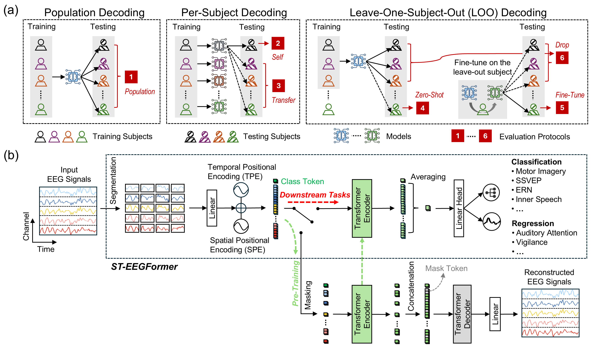
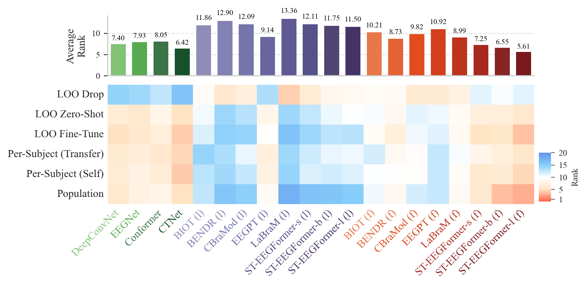

<p align="center">
  
</p>

<p align="center">
  <a href="https://eeg2025.github.io/leaderboard/"></a> <a href="https://openreview.net/forum?id=5Xwm8e6vbh"></a> <a href="https://github.com/LiuyinYang1101/STEEGFormer/releases"></a> 
</p>

**以下论文的官方 PyTorch 实现：**
> [**Are EEG Foundation Models Worth It? Comparative Evaluation with Traditional Decoders in Diverse BCI Tasks**](https://openreview.net/forum?id=5Xwm8e6vbh)（ICLR 2026）

<div align="center">
  <h3 style="color: #00407a;">
    Liuyin Yang, Qiang Sun, Ang Li, and Marc Van Hulle
  </h3>
  <p style="color: #116E8A;">
    <strong>Computational Neuroscience Group, KU Leuven</strong>
  </p>
</div>

## 🔥 新闻 🔥
* **[2026 年 5 月]** 新增分步教程，使用 **BCI-IV-2A** 作为示例，完整演示数据集接入流程（预处理 → `Dataset` 类 → YAML 注册 → 调度器 → 训练）。详见 [`easy_start/bci_iv2a_dataset_tutorial.ipynb`](easy_start/bci_iv2a_dataset_tutorial.ipynb)。
* **[2026 年 1 月]** 论文被 **ICLR 2026 接收**！
* **[2025 年 12 月]** 🥇 在 **NeurIPS 2025 EEG Foundation Challenge** 挑战赛 1 中获得**第一名**！
* **[2025 年 1 月]** ST-EEGFormer 原始论文被 ICLR 2025 拒稿

## 引用

如果您使用了我们的模型或认为其有用，请引用以下论文：

```bibtex
@inproceedings{
yang2026_steegformer,
title={Are {EEG} Foundation Models Worth It? Comparative Evaluation with Traditional Decoders in Diverse {BCI} Tasks},
author={Liuyin Yang and Qiang Sun and Ang Li and Marc M. Van Hulle},
booktitle={The Fourteenth International Conference on Learning Representations},
year={2026},
url={https://openreview.net/forum?id=5Xwm8e6vbh}
}
```

### 1. 方法论

我们的框架通过 6 种不同的解码协议评估 EEG 基础模型，提供透明且严格的基准测试，范围从简单的群体解码到具有挑战性的零样本和迁移学习场景。

<p align="center">
  
</p>

作为该基准测试的基线，我们提出了 ST-EEGFormer：一个基于 ViT 的精简基础模型。为确保透明性和可复现性，该模型纯粹通过掩码自编码器（MAE）对原始 EEG 信号进行重建预训练。

### 2. 基准测试结果

我们的全面评估表明，虽然经典神经网络解码器仍然具有很强的竞争力，但 EEG 基础模型在线性探针限制下往往表现不佳。然而，在完全微调的情况下，ST-EEGFormer-large 在所有对比模型中取得了最佳平均排名（5.61），尽管其参数量较大（>300M）。

<p align="center">
  
</p>

## 许可证

本项目采用 **MIT 许可证** — 详见 [LICENSE](LICENSE) 文件。

> **注意：** MIT 许可证仅适用于本仓库提供的**源代码**。相关研究论文、架构图和"ST-EEGFormer"名称版权归 © 2026 Computational Neuroscience Group, KU Leuven 所有，保留所有权利。

---

## 3. 环境

模型使用 **PyTorch** 实现，可在标准 Python 环境中使用。

> **预训练使用的 Python 版本：** `3.11.5`

| 类别 | 包名 | 版本 | 说明 |
| :--- | :--- | :---: | :--- |
| **核心** | `torch` | 2.4.1 | 深度学习框架 |
| **核心** | `timm` | 1.0.10 | Transformer 模型实现 |
| **额外** | `wandb` | 0.22.2 | 实验记录与监控 |
| **额外** | `mat73` | 0.65 | 加载 MATLAB v7.3 文件 |
| **额外** | `scikit-learn` | 1.3.2 | 评估指标和工具 |

### 3.1 经典 EEG 模型依赖

如需运行**经典 EEG 模型**的训练代码，还需安装：

#### 用于除 SSVEP 外的所有下游任务

| 包名 | 版本 | 说明 |
| :--- | :---: | :--- |
| `scipy` | 1.16.0 | 通用科学计算工具 |
| `numpy` | 1.25.2 | 核心数值计算库 |
| `mne` | 1.9.0 | EEG 预处理和数据处理 |
| `pyriemann` | 0.6 | 基于黎曼几何的 EEG 分类 |
| `scikit-learn` | 1.4.2 | 机器学习工具包 |
| `lightgbm` | 4.6.0 | 用于表格特征的梯度提升模型 |

---

#### 专用于 SSVEP 任务（因 meegkit 工具箱与其他包有兼容性问题）

| 包名 | 版本 | 说明 |
| :--- | :---: | :--- |
| `scipy` | 1.15.3 | 通用科学计算工具 |
| `numpy` | 2.2.6 | 核心数值计算库 |
| `mne` | 1.9.0 | EEG 预处理和数据处理 |
| `scikit-learn` | 1.7.0 | 机器学习工具包 |
| `meegkit` | 0.1.9 | EEG/MEG 信号处理工具 |

---

## 4. 模型规格

**ST-EEGFormer** 专为 **128 Hz EEG 数据**设计。

- 预训练重建 **6 秒 EEG 片段**
- 支持最多 **142 个 EEG 通道**
- 推荐输入：**≤ 6 秒片段**，采样率 **128 Hz**

可用/预训练通道列表可在以下位置找到：

```text
pretrain/senloc_file
```

## 5. 快速开始

包含模型使用最小教程的 Jupyter notebook 位于：

```text
easy_start/simple_example.ipynb
```

如需完整演示如何将新下游数据集接入基准测试流程 — 原始数据 → 预处理 → `Dataset` 类 → YAML 注册 → 调度器 → 训练 — 请参见：

```text
easy_start/bci_iv2a_dataset_tutorial.ipynb
```

该教程使用 **BCI Competition IV-2A** 作为示例，最后包含一个验证训练单元，复现了 EEGNet、ST-EEGFormer-small 和 ST-EEGFormer-large 的逐被试解码运行，使用生产训练方案。

## 6. 可复现性

如需预训练模型，使用脚本：

```text
pretrain/ddp_train_eeg.py
```

你需要准备自己的自定义数据集，提供 EEG 片段和对应的通道索引。

如需使用神经网络在下游 BCI 任务上运行基准测试实验，使用：

```text
benchmark/neural_networks/wandb_downstream_evaluation.py
```

数据集准备和配置详情，请参阅以下目录中的 README 文件：

```text
benchmark/neural_networks
```

如需使用 BCI-IV-2A 的端到端示例，请遵循 [`easy_start/bci_iv2a_dataset_tutorial.ipynb`](easy_start/bci_iv2a_dataset_tutorial.ipynb)。

EEG 2025 Foundation Challenge 的代码位于：

```text
eeg_foundation_2025
```

其中模型做了轻微修改（包含用于 HBN 数据集的额外通道嵌入）。

---

## 7. 预训练模型

我们在 GitHub Releases 中发布了 small、base 和 large 三个版本的 ST-EEGFormer 模型。

[ST-EEGFormer-small 发布](https://github.com/LiuyinYang1101/STEEGFormer/releases/tag/ST-EEGFormer-small)

[ST-EEGFormer-base 发布](https://github.com/LiuyinYang1101/STEEGFormer/releases/tag/ST-EEGFormer-base)

[ST-EEGFormer-large 发布](https://github.com/LiuyinYang1101/STEEGFormer/releases/tag/ST-EEGFormer-large)

此外，我们提供了 large-ST-EEGFormerV2，该模型在 HBN 数据集上进行了进一步预训练，用于 EEG 2025 Foundation Challenge。

[ST-EEGFormer-large 发布-HBN](https://github.com/LiuyinYang1101/STEEGFormer/releases/tag/ST-EEGFormer-largeV2)

---

## 8. 即将推出 🚀

我们正在开发以下更新：

* **数据集预处理代码**：用于清洗和格式化基准测试数据集的标准化脚本。*（BCI-IV-2A 现已在 [`easy_start/bci_iv2a_dataset_tutorial.ipynb`](easy_start/bci_iv2a_dataset_tutorial.ipynb) 中提供；其余将陆续发布。）*
* **分步教程**：更多演示模型使用的 Jupyter notebook。
