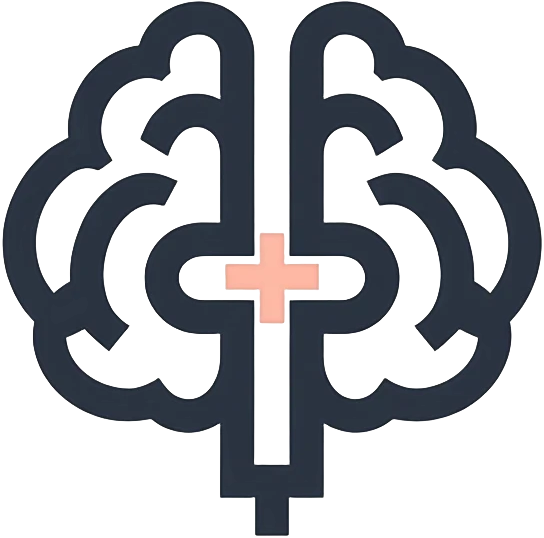
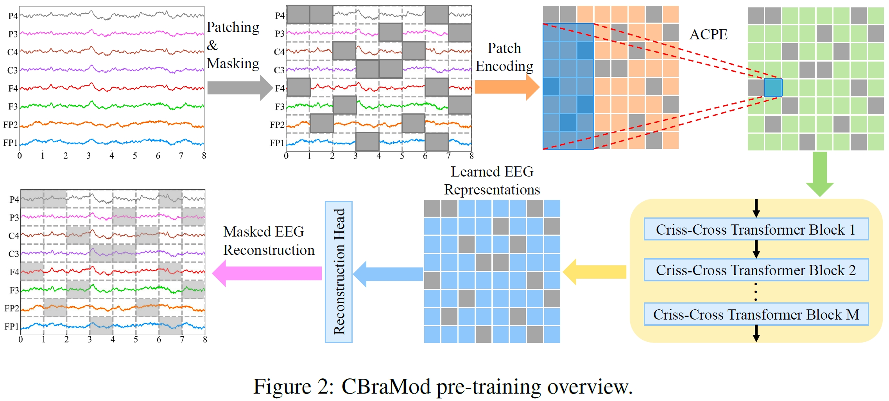

<div align="center">

# CBraMod

_一个用于 EEG 解码的交叉大脑基础模型_

[](https://arxiv.org/abs/2412.07236)
[](https://openreview.net/forum?id=NPNUHgHF2w)
[](https://huggingface.co/weighting666/CBraMod)


</div>


<div align="center">

</div>


<p align="center">
    | 🔍&nbsp;<a href="#-关于">关于</a>
    | 🔨&nbsp;<a href="#-环境配置">环境配置</a>
    | 🚢&nbsp;<a href="#-预训练">预训练</a>
    | ⛵&nbsp;<a href="#-微调">微调</a>
    | 🚀&nbsp;<a href="#-快速开始">快速开始</a>
    | 🔗&nbsp;<a href="#-引用">引用</a>
</p>

🔥 新闻：感谢超过 100 颗星！我们进一步优化了代码以提升稳定性。感谢您在完善实现过程中的耐心——持续的 EEG 研究正在推动标准化流程的发展。

🔥 新闻：论文 "_CBraMod: A Criss-Cross Brain Foundation Model for EEG Decoding_" 已被 ICLR 2025 接收！

## 🔍 关于

我们提出了 **CBraMod**，一种新颖的 EEG 基础模型，用于各种临床和 BCI 应用中的 EEG 解码。
论文预印版可在 [arXiv](https://arxiv.org/abs/2412.07236) 查看。
论文正式版将在 [OpenReview](https://openreview.net/forum?id=NPNUHgHF2w) 上发布。

<div align="center">

</div>

## 🔨 环境配置

安装 [Python](https://www.python.org/downloads/)。

安装 [PyTorch](https://pytorch.org/get-started/locally/)。

安装其他依赖：
```commandline
pip install -r requirements.txt
```

## 🚢 预训练

您可以使用以下代码在我们的预训练数据集或自定义预训练数据集上预训练 CBraMod：
```commandline
python pretrain_main.py
```
我们已在 [HuggingFace🤗](https://huggingface.co/weighting666/CBraMod) 上发布了预训练检查点。

## ⛵ 微调

您可以使用以下代码在我们选定的下游数据集上微调 CBraMod：
```commandline
python finetune_main.py
```

## 🚀 快速开始

您可以使用以下示例代码在自定义下游数据集上微调预训练的 CBraMod：
```python
import torch
import torch.nn as nn
from models.cbramod import CBraMod
from einops.layers.torch import Rearrange

device = torch.device("cuda:0" if torch.cuda.is_available() else "cpu")
model = CBraMod().to(device)
model.load_state_dict(torch.load('pretrained_weights/pretrained_weights.pth', map_location=device))
model.proj_out = nn.Identity()
classifier = nn.Sequential(
  Rearrange('b c s p -> b (c s p)'),
  nn.Linear(22*4*200, 4*200),
  nn.ELU(),
  nn.Dropout(0.1),
  nn.Linear(4 * 200, 200),
  nn.ELU(),
  nn.Dropout(0.1),
  nn.Linear(200, 4),
).to(device)

# mock_eeg.shape = (batch_size, num_of_channels, time_segments, points_per_patch)
mock_eeg = torch.randn((8, 22, 4, 200)).to(device)

# logits.shape = (batch_size, num_of_classes)
logits = classifier(model(mock_eeg))
```

## 🔗 引用

如果您在研究或应用中使用了本仓库，请使用以下 BibTeX 进行引用：
```bibtex
@inproceedings{wang2025cbramod,
    title={{CB}raMod: A Criss-Cross Brain Foundation Model for {EEG} Decoding},
    author={Jiquan Wang and Sha Zhao and Zhiling Luo and Yangxuan Zhou and Haiteng Jiang and Shijian Li and Tao Li and Gang Pan},
    booktitle={The Thirteenth International Conference on Learning Representations},
    year={2025},
    url={https://openreview.net/forum?id=NPNUHgHF2w}
}
```

## ⭐ 星标历史
<div align="center">
    <a href="https://star-history.com/#wjq-learning/CBraMod&Date">
        
    </a>
</div>
