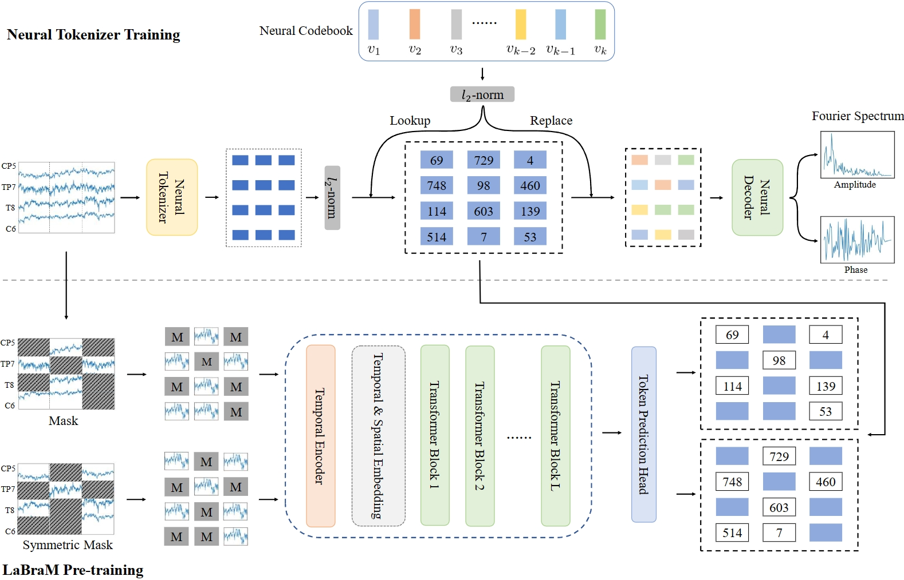

# LaBraM

我们 ICLR 2024 论文的官方实现：
[**Large Brain Model for Learning Generic Representations with Tremendous EEG Data in BCI**](https://openreview.net/forum?id=QzTpTRVtrP)



## 摘要

当前的基于脑电信号（EEG）的深度学习模型通常针对特定数据集和脑机交互（BCI）应用进行设计，这限制了模型的规模，从而降低了其感知能力和泛化能力。最近，大语言模型（LLM）在文本处理领域取得了前所未有的成功，这促使我们探索大型 EEG 模型（LEM）的潜力。我们希望 LEM 能够突破不同 EEG 数据集任务类型的限制，通过无监督预训练获得 EEG 信号的通用感知能力，然后针对不同的下游任务进行微调。然而，与文本数据相比，EEG 数据集通常体量较小且格式差异很大。例如，可能存在电极数量不匹配、数据样本长度不等、任务设计多样以及信噪比较低等问题。为了克服这些挑战，我们提出了一种统一的 EEG 基础模型——大型大脑模型（LaBraM）。LaBraM 通过将 EEG 信号分割为 EEG 通道补丁来实现跨数据集学习。使用向量量化的神经频谱预测来训练一个语义丰富的神经分词器，将连续的原始 EEG 通道补丁编码为紧凑的神经编码。然后我们通过预测被遮蔽的 EEG 通道补丁的原始神经编码来预训练神经 Transformer。LaBraM 在约 20 个数据集中约 2,500 小时的各类 EEG 信号上进行了预训练，并在多种不同类型的下游任务上进行了验证。在异常检测、事件类型分类、情绪识别和步态预测上的实验表明，我们的 LaBraM 在各自领域均优于所有对比的 SOTA 方法。

---

## 环境配置

创建环境并安装依赖：

```bash
conda create -n labram python=3.11
conda activate labram
conda install pytorch==2.0.1 torchvision==0.15.2 torchaudio==2.0.2 pytorch-cuda=11.8 -c pytorch -c nvidia
conda install tensorboardX
pip install -r requirements.txt
```

---

## [重要] 在您自己的数据集上微调

您可以通过参考 TUAB 和 TUEV 的微调脚本，将 LaBraM 适配到您自己的数据集。只需将代码中数据集特定的部分替换为您自己的数据。在这样做时，请确保：

1. 加载预训练的 LaBraM 检查点。
2. 提供输入通道顺序列表以指定通道配置。

**以上两点对于获得 LaBraM 的正常性能至关重要。**

---

## 运行实验

### 1. 准备预训练数据

使用以下脚本将原始 EEG 文件（如 `.cnt`、`.edf`、`.bdf`）转换为 HDF5 格式：

```
dataset_maker/make_h5dataset_for_pretrain.py
```

您也可以实现自己的预处理流程，但请确保与我们论文中的设置匹配：

* 移除不相关的通道
* 带通滤波：**0.1–75 Hz**
* 陷波滤波：**50 Hz**
* 重采样至 **200 Hz**
* 设置单位为 **µV**

---

### 2. 训练神经分词器

分词器通过**向量量化的神经频谱预测（VQ-NSP）**进行训练。我们建议在 **8 × NVIDIA RTX 3090（或更好）** GPU 上进行训练。

```bash
OMP_NUM_THREADS=1 torchrun --nnodes=1 --nproc_per_node=8 run_vqnsp_training.py \
    --output_dir ./checkpoints/vqnsp/ \
    --log_dir ./log/vqnsp/ \
    --model vqnsp_encoder_base_decoder_3x200x12 \
    --codebook_n_emd 8192 \
    --codebook_emd_dim 64 \
    --quantize_kmeans_init \
    --batch_size 128 \
    --opt adamw \
    --opt_betas 0.9 0.99 \
    --weight_decay 1e-4 \
    --warmup_epochs 10 \
    --epochs 100 \
    --save_ckpt_freq 20
```

---

### 3. 预训练 LaBraM

通过从 EEG 通道补丁中重建被遮蔽的神经编码来预训练 LaBraM：

```bash
OMP_NUM_THREADS=1 torchrun --nnodes=1 --nproc_per_node=8 run_labram_pretraining.py \
    --output_dir ./checkpoints/labram_base \
    --log_dir ./log/labram_base \
    --model labram_base_patch200_1600_8k_vocab \
    --tokenizer_model vqnsp_encoder_base_decoder_3x200x12 \
    --tokenizer_weight ./checkpoints/vqnsp.pth \
    --batch_size 64 \
    --lr 5e-4 \
    --warmup_epochs 5 \
    --clip_grad 3.0 \
    --drop_path 0. \
    --layer_scale_init_value 0.1 \
    --opt_betas 0.9 0.98 \
    --opt_eps 1e-8 \
    --epochs 50 \
    --save_ckpt_freq 5 \
    --codebook_dim 64 \
    --gradient_accumulation_steps 1
```

---

### 4. 在下游任务上微调

使用以下脚本预处理数据集（如 TUAB、TUEV）：

```
dataset_maker/make_TUAB.py
dataset_maker/make_TUEV.py
```

这包括预处理以及训练/验证/测试集的划分。**学习率**和**预热轮数**等超参数对结果影响很大——请根据最佳性能进行调整。以下是 TUAB 示例：

```bash
OMP_NUM_THREADS=1 torchrun --nnodes=1 --nproc_per_node=8 run_class_finetuning.py \
    --output_dir ./checkpoints/finetune_tuab_base/ \
    --log_dir ./log/finetune_tuab_base \
    --model labram_base_patch200_200 \
    --finetune ./checkpoints/labram-base.pth \
    --weight_decay 0.05 \
    --batch_size 64 \
    --lr 5e-4 \
    --update_freq 1 \
    --warmup_epochs 5 \
    --epochs 50 \
    --layer_decay 0.65 \
    --drop_path 0.1 \
    --save_ckpt_freq 5 \
    --disable_rel_pos_bias \
    --abs_pos_emb \
    --dataset TUAB \
    --disable_qkv_bias \
    --seed 0
```

---

## 引用

如果您觉得我们的论文/代码有用，请考虑引用我们的工作：

```bibtex
@inproceedings{
jiang2024large,
title={Large Brain Model for Learning Generic Representations with Tremendous {EEG} Data in {BCI}},
author={Wei-Bang Jiang and Li-Ming Zhao and Bao-Liang Lu},
booktitle={The Twelfth International Conference on Learning Representations},
year={2024},
url={https://openreview.net/forum?id=QzTpTRVtrP}
}
```
